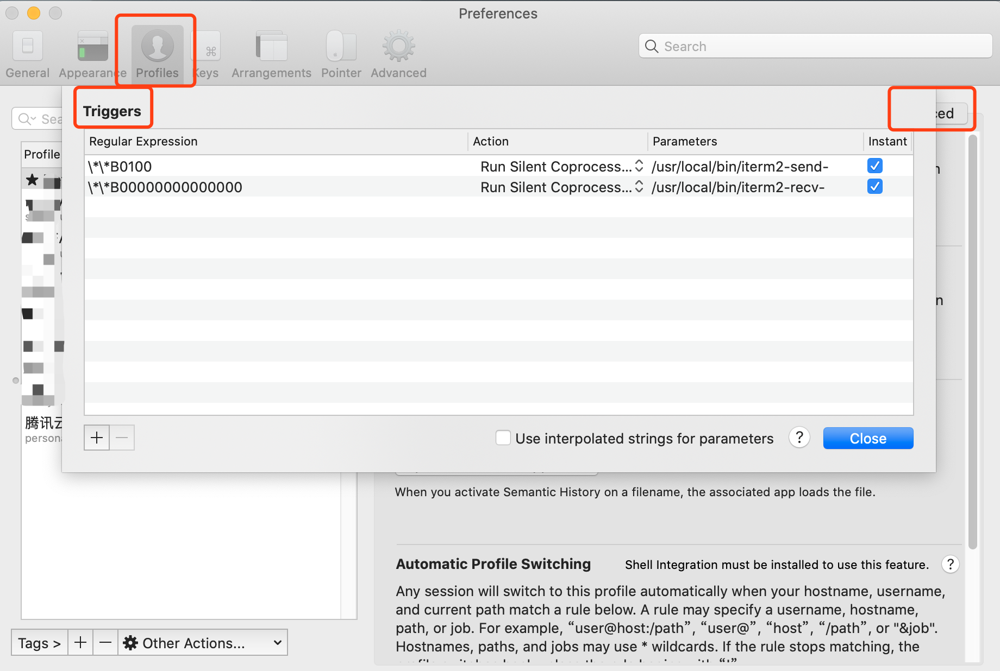
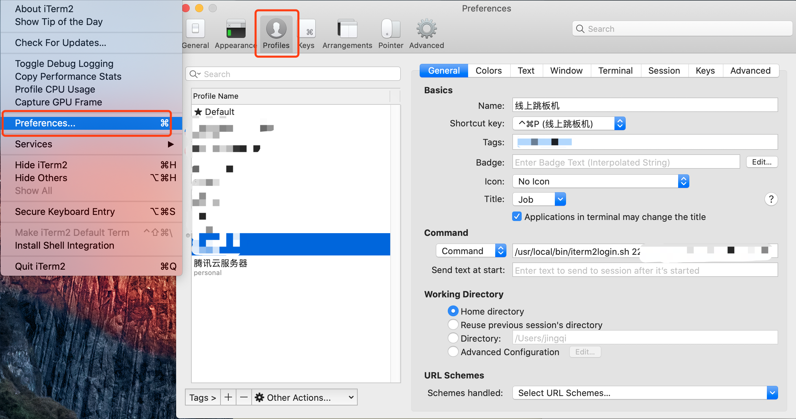

<!-- START doctoc generated TOC please keep comment here to allow auto update -->
<!-- DON'T EDIT THIS SECTION, INSTEAD RE-RUN doctoc TO UPDATE -->
**Table of Contents**  *generated with [DocToc](https://github.com/thlorenz/doctoc)*

- [iterm2-tool](#iterm2-tool)
  - [rz、sz 上传下载](#rzsz-%E4%B8%8A%E4%BC%A0%E4%B8%8B%E8%BD%BD)
  - [使用脚本登录](#%E4%BD%BF%E7%94%A8%E8%84%9A%E6%9C%AC%E7%99%BB%E5%BD%95)

<!-- END doctoc generated TOC please keep comment here to allow auto update -->

# iterm2-tool

## rz、sz 上传下载

有时候想传点小工具到远端服务器，或者将服务器上的排查结果下载到本地进行分析，这时候就可以祭出我们的大杀器 rz、sz 脚本。

网上也有很多介绍和安装步骤，但是由于配置问题，弄了挺久，最后才成功配置，所以这次记录下自己的配置流程：

- **安装 lrzsz**

HomeBrew 是 mac 上一个很好用的包管理软件，如果没安装的话，可以使用以下命令安装：

```shell
$ ruby -e "$(curl -fsSL https://raw.githubusercontent.com/Homebrew/install/master/install)"
```

- **拷贝脚本文件**

定位到 /usr/local/bin 目录

下载两个文件并放入 iterm2-send-zmodem.sh & iterm2-recv-zmodem.sh

- **添加权限**

```shell
$ cd /usrlocal/bin
$ chmod 777 iterm2-*
```

- **添加触发器**

定位到 Perferences -> Profiles -> Advanced -> Triggers -> Edit



左下角的 + 号，添加以下两个触发器：

```shell
一、SZ 命令
Regular expression: \*\*B0100
Action: Run Silent Coprocess
Parameters: /usr/local/bin/iterm2-send-zmodem.sh

二、RZ 命令
Regular expression: \*\*B00000000000000
Action: Run Silent Coprocess
Parameters: /usr/local/bin/iterm2-recv-zmodem.sh
```

- **使用方式**

```shell
# 上传本地文件到服务器，直接输入 rz 命令，将会弹出文件选择框
$ rz
# 将服务器的文件发送到本地，输入 sz 命令，同时后面接上服务器的文件路径
$ sz /{patch}/file.out
```

通过上面的配置方式，就可以愉快上传和下载文件了

---

## 使用脚本登录

如果有小伙伴的登录方式跟我们相似，是通过跳板机，服务器信息是通过跳板机管理和访问的，这样无法直接 ssh 连上远端服务器，这时候可以考虑这种方式，在 iterm2 的 profiles 界面，保存登录命令，通过 profile 直接登录。

- **添加脚本**

shell 脚本保存的目录可以自己设置，个人保存在了 **/usr/local/bin/iterm2login.sh** 文件下

```shell
$ sudo vim /usr/local/bin/iterm2login.sh
#!/usr/bin/expect

set timeout 30
spawn ssh -p [lindex $argv 0] [lindex $argv 1]@[lindex $argv 2]
expect {
        "(yes/no)?"
        {send "yes\n";exp_continue}
        "password:"
        {send "[lindex $argv 3]\n"}
        "Password"
        {send "[lindex $argv 3]\n"}
}
interact%
```

保存后记得赋予该脚本可执行权限（由于在个人电脑，直接赋予了 777 权限(#^.^#)）

```shell
$ chmod 777 /usr/local/bin/iterm2login.sh
```

- **保存 profile 信息**

在这里设置配置文件信息



左下角的 + 号，进行添加一个配置文件，接着在右边的 Command 栏，输入以下命令：

```shell
/usr/local/bin/iterm2login.sh port root ip password
```

|字段名|含义|
|--|--|
|port |开放登录的端口号，常见的是 22|
|root |登录者角色 |
|ip |远端服务器 ip |
|password|登录角色对应的密码 |

根据上述格式，可能输入如下：

```shell
/usr/local/bin/iterm2login.sh 22 root 127.0.0.1 123456
```

输入完成后，可以通过快捷键：⌘（command） + O（英文 O），调出配置信息，然后选择刚才保存的配置，iterm2 调用脚本后，会自动帮我们输入密码，进行登录。

- **配置 Shortcut Key**

在右侧，有一行 「Shortcut Keys」，点击下拉选择，可以选一个自己喜欢，而且与其它软件不冲突的快捷键。

例如我使用了 「⌘（command） + Shift + P」，这样可以快速的通过快捷键，直接就能进行登录
